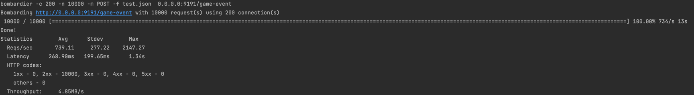
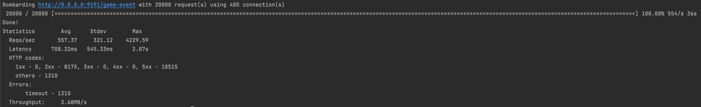
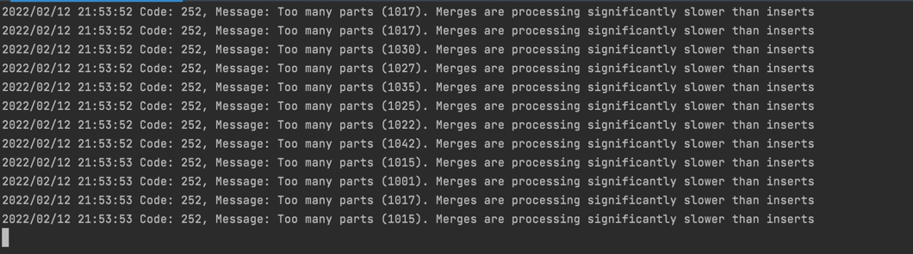

### Project Clickhouse
1. To run project you must install docker from: `https://docs.docker.com/get-docker/`
2. And docker-compose from `https://docs.docker.com/compose/install/`
3. To perform load testing you can install bombardier tool from `https://github.com/codesenberg/bombardier`

### Steps to build and run docker containers that would allow us to interact with service and to make performance testing:
 1. `docker-compose up -f docker-compose.yaml up -d` Server would open 9191 port and endpoint for perf testing will be available under `0.0.0.0:9191/game-event`
 2. Run `make load-test` to run bombardier presetted load testing.

### Current results for perf-testing with 200 connections and 10000 requests:

### Results for perf-testing with 400 connections and 20000 requests:

## P.S. Don't forget that real bottleneck for this perf tests is configuration and current tuning of clickhouse server
